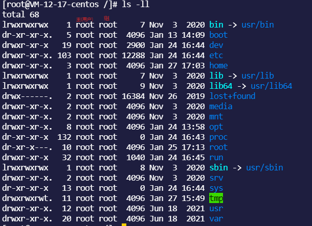

## linux目录

| 目录            | 解释                                                                                                         |
| --------------- | ------------------------------------------------------------------------------------------------------------ |
| **/bin**        | 存放最常使用的命令                                                                                           |
| **/boot**       | 启动Linux时使用的一些核心文件                                                                                |
| **/dev**        | 存放linux外部的设备,在linux中访问设备的方式和访问文件的方式是相同的                                          |
| **/etc**        | <span style="color:red">这个目录用来存放所有的系统管理所需的配置文件和子目录</span>                          |
| **/home**       | <span style="color:red">用户的主目录,在linux中共每个用户都有一个自己的目录,一般该目录是由用户账号命名</span> |
| **/lib**        | 这个目录存放系统最基本的动态连接共享库,类似于windows的dll文件                                                |
| **/lost+found** | 一般情况是空的,非法关机后,就会存放一些文件                                                                   |
| **/media**      | 识别设备(例如u盘等)识别后,linux会把识别的设备挂载到这个目录                                                  |
| **/mnt**        | 让用户临时挂别的文件系统,可以将光驱挂载在`/mnt`                                                              |
| **/opt**        | 这是给主机额外安装软件所摆放的                                                                               |
| **/proc**       | 虚拟目录.存放系统内存的映射                                                                                  |
| **/root**       | <span style="color:red">系统管理员</span>                                                                    |
| **/run**        | 临时文件系统,存储系统启动依赖的信息.(重启会被删掉)                                                           |
| **/sbin**       | 存放的是使用的系统管理程序                                                                                   |
| **/srv**        | 存放一些服务启动之后需要提取的数据                                                                           |
| **/sys**        | 2.6之后才有的.该目录安装了2.6内核中出现的新的文件系统sysfs                                                   |
| **/tmp**        | 存放临时文件,用完即删                                                                                        |
| **/usr**        | 用户的很多程序文件都在这个目录下,类似于`program files`                                                       |
**/usr/bin** 系统用户使用的应用程序
**/usr/sbin** | 超级用户使用的比较高级的管理员程序和系统守护程序
**/usr/src** | 内核源代码默认存放的目录
**/var** | 这个目录存放着不断扩充的东子

## 常用命令

### 目录相关的命令

> cd 切换目录

* `./`  代表当前目录
* `..`  代表上一级目录
* `/`   绝对路径

>ls:列出目录

* `-a`:查看所有的文件,包括隐藏文件
* `-l`:列出所有的文件,包括文件的属性和权限(没有隐藏文件)

> pwd:显示当店用户所在的目录
>
>mkdir:创建一个目录
>
>touch 创建一个文件

* **rm**:删除目录或者,只能删除空目录
  * `-r`:目录中有文件,递归删除目录
  * `-f`:强制删除,不会出现警告
  * `-i`:互动,询问是否删除

> mv  移动文件或者目录  重命名文件

* `-f`:强制移动
* `-u`:只替换已经更新的文件

1. `mv a.md b.md`:修改文件名称
2. `mv b.md mv`:将文件移动到mv目录下
3. `mv b.md ../a.md`:将文件移动到上级,并且更改文件名

> cp 复制文件或者目录

* cp 被复制文件的路径    复制的目的路径
* `y`:确定覆盖原来有的文件
* `n`:不覆盖

### 查看文件属性和修改


* 第一个root是`属主`,第二个root是`属组`

* 关于第一个字符的含义
  1. `-d`:代表是目录
  2. `-`:代表的是文件
  3. `-l`:代表的是链接文档(`link file`)
  4. `b`:表示为装置文件里面的可供储存的接口设备(可随机存取的装置)
  5. `c`:表示为装置文件里卖弄的串行端口设备(键盘,鼠标等一次性读取装置)

* 剩下字符的含义
  1. `r`:表示可读
  2. `w`:表示可写
  3. `x`:代表可执行
  4. `-`:代表没有这个权限



> 修改文件属性

1. **chagrp:更改文件数组**
   * `chgrp [-R] 属组名 文件名`
   * `-R`:递归更改文件属组.放在更改某文件的同时,他目录下的所有文件属性都会更改
2. **chown:更改文件属主,也可以同时更改文件属组**
   * `chown [-R] 属主名 文件名`
   * `chown [-R] 属主名:属组名 文件名`
3. <span style="color:red">**chmod:更改文件9个属性**</span>(最重要)
   * `chmod [-R] xyz 文件或者目录`
   * 两种设置:一种是数字(常用)一种是符号
   * 基本权限:`owner/group/others`每个都有自己身份的`read/write/execute`(途中的两个root分别就是主和组)
4. 每个字符对应的数字

```shell
r:4   w:2   x:1
chmod 770 filename # rwxrwx---
```

* 例如:`chmod 777 filename`:赋予文件最高权限

### 文件内容查看

* `cat`:从第一行开始显示文件的内容
* `tac`:从最后一行显示文件的内容
* `nl`:现实的时候顺道输出行号
* `more`:一页一页的显示文件内容(空格代表翻页,enter代表按行向下翻)
* `less`:与more相比,可以往前翻页(上下键,q是退出)
  * 查询:`/+查询字符`从头到尾向下查询,`?+查询字符`从尾到头向下查询
* `head`:只有头几行
* `tail`:只有尾几行

>`/etc/sysconfig/network-scripts`:linux网络配置文件

### linux链接的概念

* **硬链接**:硬链接相当于指向的是文件实际存储路径.可以使用这种机制建立到一些重要文件,防止误删
* **软链接**:软连接相当于指向文件路径,删除源文件,就访问不了

* 创建链接:`ln`
  1. 硬链接:`ln f1 f2`,创建1个f1的硬链接
  2. 软链接:`ln -s f1 f3`,s代表软连接.创建1个f1的软链接`f3->f1`

>ls -a有箭头指向的是软连接

### Vim

>三种使用模式

1. 命令模式
2. 输入模式
3. 底线命令模式

* 使用vim就进入了命令模式
  1. `i`:切换到输入模式
  2. `x`:删除当前光标所在的字符
  3. `:`:切换到底线命令模式,在最底一行输入模式
  4. `q`:强制退出.`w`:保存.`wq`:保存并退出
  5. `set nu`:设置行号
  6. `/`或者`?`+查询字符:查找字符的位置.`/`从头到尾向下查询`?`从尾到头向下查询

### 账号管理

* 使用root账户去管理

> 添加用户:`useradd -选项 用户名`

* `-m`:使用者目录.没有则自动建立
* `-c`:指定一段注释性描述
* `-d 目录`:指定用户主目录,如果此目录不存在,则同时使用`-m`选项,可以创建主目录
* `-g 用户组`:指定用户所属的用户组
* `-G 用户组`:指定用户所属的附加组
* `-s Shell`:指定用户的登录Shell
* `-u 用户号`:指定用户的用户号,如果同时有`-o`,则可以重复使用其它用户的标识号

* **创建用户的本质就是在`/etc/password`种写入一个用户的信息**

> 删除指定的用户:`userdel 选项 用户名`

* `-r`:删除用户的时候将他的目录也一起删掉

> 修改用户:`usermod 选项 用户名`

* `-m -c -d -g -G -s -u`:这些和以上的选项作用一样

```shell
[root@VM-12-17-centos home]# usermod -d /home/fw1314 fw

# 在/etc/password查看
fw:x:1001:1001::/home/fw1314:/bin/bash
```

### 切换用户

1. 切换用户的命令:`su username`(username是用户名)
2. 从普通的用户切换到`root`:`su root`需要输入密码
3. 在终端输入exit或者`ctrl+d`也可以退回到原来的账号
4. `hostname 主机名`:修改主机名

>* root给用户设置密码:`passwd 用户名`
>* 普通用户直接输入:`passwd`,修改密码

### 锁定账户

>* `passwd -l 用户名`:将该账户锁定
>* `passwd -d 用户名`:将这个账户密码清空

## 用户组管理

>每个用户都有一个用户组,系统可以对一个用户组种的所有用户进行集中管理(例如开发,测试,运维,root等).不同的Linux系统对用户组的规定有所不同
>
>用户组的管理涉及用户组的添加,修改,删除.组的增加,删除和修改实际上就是对`/etc/group`文件的更新

* 创建一个用户组`groupadd 组名`
  * 查看`cat /etc/group`
  * 创建完用户组可以得到一个组的id`-g id`,如果不指定可以自增

```shell
[root@VM-12-17-centos home]# groupadd fw1314 -g 120
# fw1314:x:120:
```

>删除用户组`groupdel 组名`
>
>修改用户组的权限`groupmod 选项 组名`

* `-g`:修改id
* `-n`:修改组名

>修改用户组(一般直接在创建用户时使用`-G`分配组)

* 普通用户`newgrp 组名`

### 文件的查看

```shell
root:x:0:0:root:/root:/bin/bash
```

* `/etc/password`:用户名:口令(登录密码,不可见):用户标识符:组标识号:注释性描述:主目录:登录shell
  * 每一行都代表一个用户,从中可以看出这个用户的主目录在哪,属于哪一个组
  * 密码放在`/etc/shadow`中

### 磁盘管理

1. `df`:列出文件系统整体的磁盘使用量(`-h`使用十进制表示)
2. `du`:检查当前磁盘空间的使用量
   * `du -sm /*`:检查根目录下所占用的容量

>Mac或者用Linux挂载一些本地磁盘或者文件

* `mount /dev/fw /mnt/fw`:将外部设备`/dev/fw`挂载到`/mnt/fw`,因为外部设备都会在`/dev/fw`中
  * `umount`:卸载.`-f`强制卸载

## 进程管理

`ps 选项`:查看系统中正在进行的进程信息

选项       解释
-a         显示当前终端运行的所有进程信息(当前的进程)
-u         以用户的信息显示进程
-x         显示后台运行进程的参数

```shell
A|B #使用A命令的结果来操作B命令
ps -aux # 查看所有的进程
```

* `grep`:查找文件中符合条件的字符串

```shell
ps -aux | grep nginx
```

* **ps -ef**:查看父进程的信息

```shell
ps -ef | grep nginx

# 一般使用目录树结构查看
pstree -pu
```

* **pstree**:以目录树结构查看
  * `-p`:显示父id
  * `-u`:显示用户组

### 结束进程

* `kill 进程id`:杀掉进程
  * `-9`:强制杀掉进程

```shell
kill -9 873518
```
